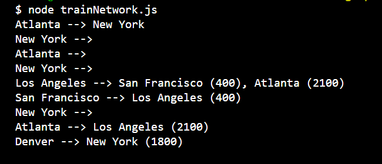

# Graphs

## Description
This project demonstrates the implementation of a train network using a custom graph data structure in JavaScript. The graph is weighted, directed, and supports operations such as adding vertices, adding weighted edges, and removing routes and stations. The code showcases the flexibility and functionality of the graph for representing and managing train routes and stations.
## Codecademy Module 
Pass the Technical Interview with JavaScript